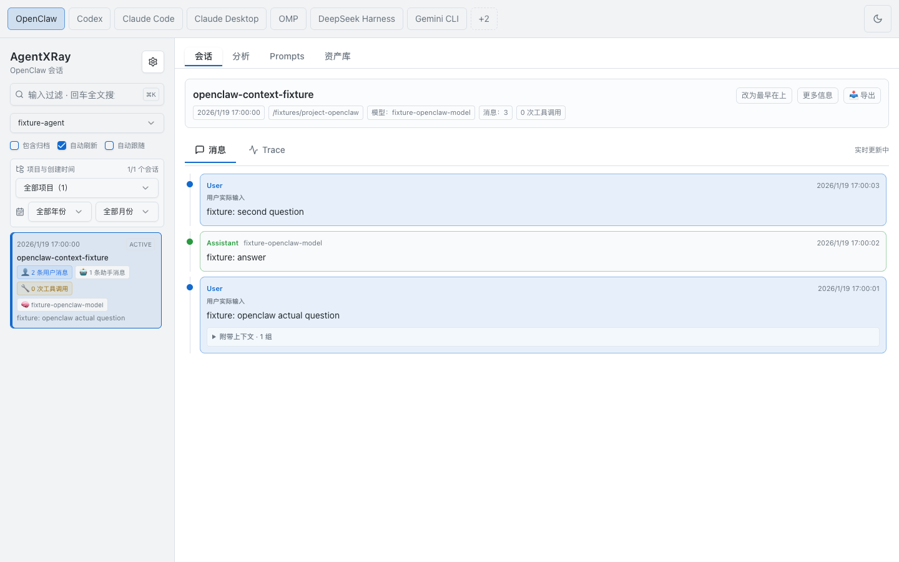
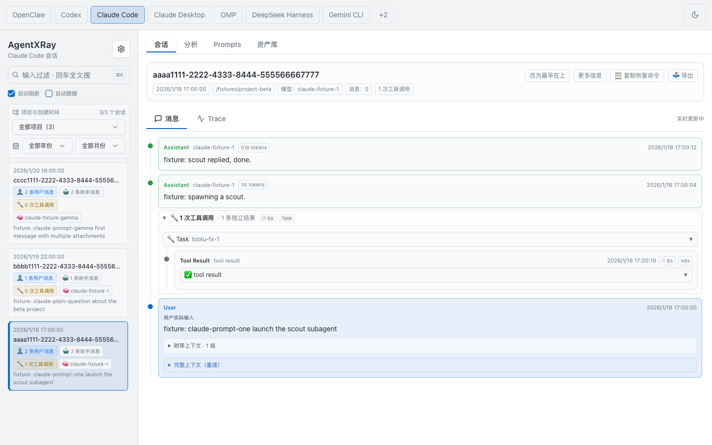
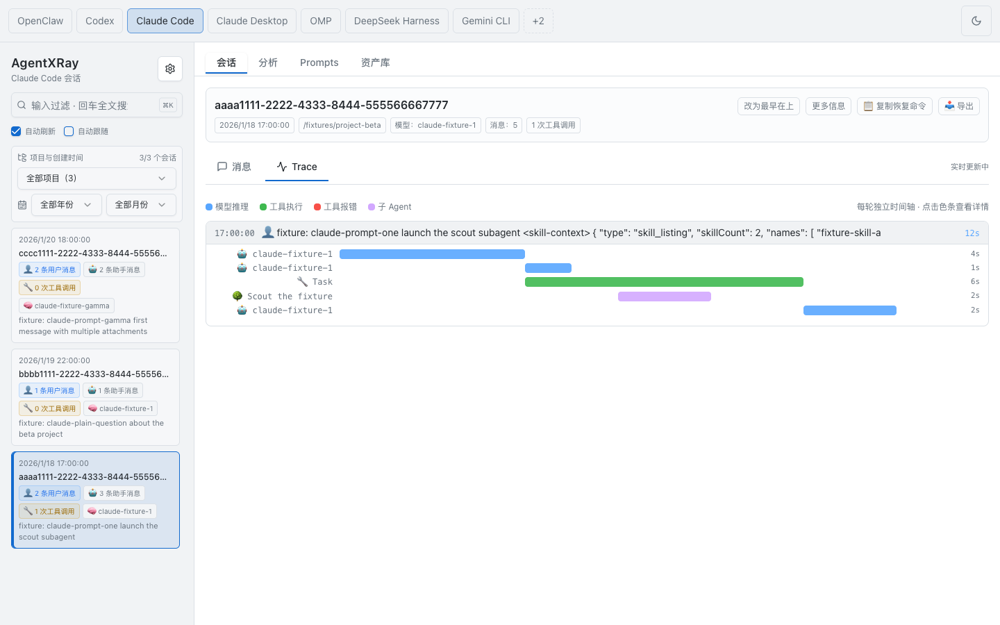
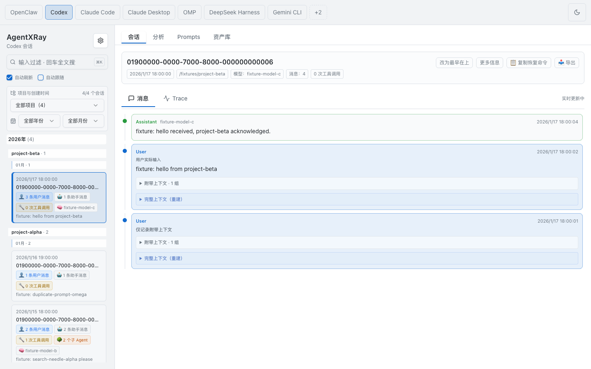
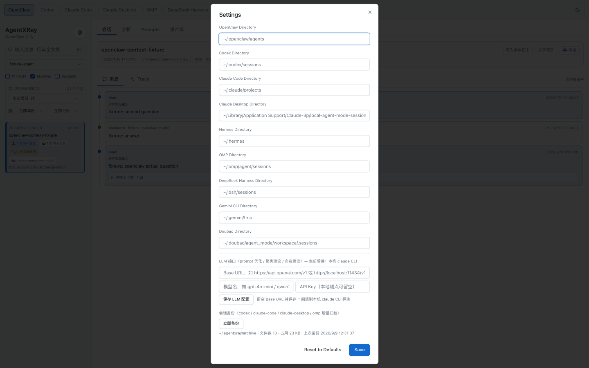

# AgentXRay

AI Agent 会话 X 光透视工具，支持 **OpenClaw**、**Codex**、**Claude Code**、**Claude Desktop**、**Hermes**、**OMP**、**DeepSeek Harness**、**Gemini CLI** 和 **Doubao** —— 一个界面全搞定。

[English](README.md) | 中文

**[在线 Demo](https://alloevil.github.io/AgentXRay/)**（合成示例数据，非真实用户会话）

<p align="center">
  
  <a href="https://github.com/alloevil/AgentXRay/actions/workflows/test.yml"></a>
  <a href="https://scorecard.dev/viewer/?uri=github.com/alloevil/AgentXRay"></a>
  <a href="https://github.com/alloevil/AgentXRay/releases/latest"></a>
  
  
</p>

## 为什么是 AgentXRay

AgentXRay 是一个 **local-first 的查看器，看的是你已经拥有的 agent 会话**。

LangSmith、Langfuse 这类观测平台面向的是*你自己写的* agent：接入 SDK、埋点插桩，trace 上报到托管后端。做自研 agent 时它们很好用 —— 但 Claude Code、Codex、Gemini CLI 这些现成的 CLI coding agent 不是你的代码，没法插桩。它们本来就把完整会话日志写在你的磁盘上，AgentXRay 直接读这些日志：零接入、零配置，数据不出本机。

相比自己翻原始日志，AgentXRay 把九个平台的数据源归一化到一个界面里：工具调用与结果自动配对、token 用量按会话汇总、跨平台全文搜索、prompt 提取、trace 时间线 —— 这些从一份 50MB 的会话日志里手工还原起来非常费劲。

如果你在生产环境构建和运营自己的 agent，请用 tracing 平台；如果你想看清 coding agent 到底干了什么，用 AgentXRay。



## 功能特性

- **多平台支持** — 一个界面统一查看 OpenClaw、Codex、Claude Code、Claude Desktop Agent/Cowork、Hermes、OMP、DeepSeek Harness、Gemini CLI 和 Doubao 的会话日志（dsh 的多帧 zstd 压缩日志透明解压；Gemini CLI 的 `/rewind` 回滚记录会先折叠，回滚掉的历史不会重复渲染）
- **会话浏览** — 浏览 Agent 列表，搜索/过滤会话，查看消息历史
- **工具调用检查** — 可展开的工具调用详情，包含参数和返回结果
- **Trace 视图** — 每轮对话的耗时瀑布图：模型推理（蓝）与工具执行（绿，出错为红）一目了然，点击色条跳转到对应消息
- **Prompt 提取** — 按 session 提取全部真人 prompt（自动过滤工具结果、斜杠命令、系统注入等噪音），按工作目录分组，支持搜索 / JSON 导出 / 复制
- **Prompt 优化** — 相似 prompt 自动聚类成模板，结合 session 效果归因（轮次、工具调用、错误率），通过本机 `claude` CLI 生成改写建议
- **Prompt 资产库** — 把值得复用的 prompt 收进 `~/.agentxray/library`，支持标签 / 编辑 / 搜索，一键安装为 Claude Code、Codex、OMP 的原生 slash command（`$ARGUMENTS` 原样保留，在目标 CLI 里 `/名字 参数` 直接可用）
- **全局搜索** — 一个搜索框同时搜索全部支持的平台，多关键词 AND 匹配，每条结果带平台色标 —— 包含从被 Claude Code 清理掉的会话里恢复出来的 prompt
- **会话洞察** — 聚合分析面板：工具统计、错误聚类、每日趋势
- **Spawn 追踪** — 检测并导航父子 Agent 之间的调用关系
- **OMP 子 Agent** — OMP 会话派生的子 Agent 会在摘要区以标签列出，点击即可查看子 Agent 的完整对话
- **消息时间线** — 可视化对话流程图，不同角色用不同颜色标识
- **Resume 命令** — 一键复制该会话在原 CLI 中的续跑命令（`codex resume`、`claude --resume`、`omp --resume=`）
- **摘要可折叠** — 需要更多阅读空间时可折叠会话摘要
- **自动刷新** — 会话列表和消息实时更新
- **设置面板** — 在页面上直接配置各平台目录，保存到 localStorage，无需重启
- **会话备份** — 增量归档会话日志到 `~/.agentxray/archive`，在设置面板一键触发（也会每天自动执行），未变化的文件自动跳过
- **键盘导航** — 使用方向键在会话之间切换

## 截图预览

### 会话浏览

侧边栏用于浏览 Agent 和会话列表。每个会话卡片使用语义徽标区分 👤 用户消息、🤖 助手消息、🔧 工具调用和 🌳 派生子 Agent；右侧详情区展示会话元数据、消息历史、工具活动与耗时信息。


### 工具调用检查

在对话中直接展开工具调用，即可查看结构化参数和配对结果，同时保留前后消息上下文。



### Spawn 追踪

含有子 Agent 的会话会显示可点击的 🌳 spawn 徽标。点击后会选中该会话并将右侧详情区切换到 Trace 视图，在模型与工具活动旁展示子 Agent span。



### 多平台支持

通过顶部平台切换栏一键切换 OpenClaw、Codex、Claude Code、Claude Desktop、Hermes、OMP、DeepSeek Harness、Gemini CLI 和 Doubao；侧边栏与详情区会按各平台的原生本地数据源更新。



### 设置面板

在 Settings 中配置各平台日志目录、可选 LLM 后端和会话备份。目录设置保存到 localStorage，无需重启服务即可生效。



## 快速开始

**方式一 — 通过 npm 使用 npx**（包发布到 npm 后可用）

```bash
npx @alloevil/agent-xray            # 默认 http://localhost:3800
npx @alloevil/agent-xray --port 3900 --host 127.0.0.1
```

全局安装（`npm i -g @alloevil/agent-xray`）后可直接使用 `agentxray` 命令。

**方式二 — 直接从 GitHub 运行 npx**（现在即可用，无需克隆）

```bash
npx github:alloevil/AgentXRay
```

首次运行会在本地构建 Web UI（约一分钟），之后会复用缓存。

**方式三 — 源码运行**

```bash
git clone https://github.com/alloevil/AgentXRay.git
cd AgentXRay
npm install               # 首次安装会自动构建 Web UI
npm start
```

打开 http://localhost:3800

## 使用方法

### 基本流程

1. **选择平台** — 点击顶部 `OpenClaw`、`Codex`、`Claude Code`、`Claude Desktop`、`Hermes`、`OMP`、`DeepSeek Harness`、`Gemini CLI` 或 `Doubao`
2. **选择 Agent** — OpenClaw 平台下，从下拉菜单选择 Agent（如 `xiaot`、`mimo`）
3. **浏览会话** — 会话按时间倒序排列，每张卡片显示：
   - 时间戳和状态（`active` / `archived`）
   - 消息计数：👤 用户、🤖 助手、🔧 工具调用
   - 🔗 Spawn 标记（如果该会话产生了子 Agent）
4. **查看消息** — 点击会话加载完整对话
5. **检查工具调用** — 点击 `🔧 tool_name` 按钮展开参数/结果
6. **导航 Spawn** — 点击 🔗 链接跳转到子 Agent 会话

### Prompt 视图

点击顶部 **Prompts** 标签（Sessions / Insights 旁），即可看到所有 session 的真人 prompt，按 session 所属工作目录分组。工具结果、斜杠命令回显、系统提醒、任务通知等噪音会被自动过滤。

- **预览与展开** — 每个 session 行内直接预览首条 prompt，点击展开完整列表（markdown 渲染）
- **搜索** — 实时过滤 prompt / 目录 / session
- **Export JSON** — 导出全部提取的 prompt 用于离线处理
- **分析优化** — 相似 prompt 聚类成模板，结合每个模板的 session 效果归因（平均轮次、工具调用、错误率），由 Claude 生成模板改写建议。需要服务器 PATH 中有 [`claude` CLI](https://claude.com/claude-code)；没有时聚类和归因表格仍可用
- **优化单条** — 悬停任意 prompt 点击「优化」，内联生成 Claude 改写版本

### 键盘快捷键

| 按键 | 操作 |
|------|------|
| `↑` / `↓` | 在会话间切换 |
| `Enter` | 选中高亮的会话 |

### 过滤与搜索

- **搜索框** — 按 ID 或内容过滤会话
- **包含已归档** — 切换显示/隐藏已归档（`.reset.*` / `.deleted.*`）会话
- **自动刷新** — 自动轮询获取新会话和消息
- **自动滚动** — 新内容到达时自动滚动到最新消息

## 配置

### 默认目录

| 平台        | 默认路径                      |
|-------------|-------------------------------|
| OpenClaw    | `~/.openclaw/agents`          |
| Codex       | `~/.codex/sessions`           |
| Claude Code | `~/.claude/projects`          |
| Claude Desktop | `~/Library/Application Support/Claude-3p/local-agent-mode-sessions` |
| Hermes      | `~/.hermes`                   |
| OMP         | `~/.omp/agent/sessions`       |
| DeepSeek Harness | `~/.dsh/sessions`（同时识别 `DSH_HOME`） |
| Gemini CLI  | `~/.gemini/tmp`               |
| Doubao      | `~/Library/Application Support/Doubao/Profile 2/.doubao/agent_mode/workspace/.sessions` |

### 自定义目录

**通过页面设置：** 点击侧边栏的齿轮图标，为每个平台设置自定义路径。保存到 localStorage，无需重启服务。

**通过环境变量：**

```bash
OPENCLAW_DIR=/custom/path/openclaw \
CODEX_DIR=/custom/path/codex \
CLAUDE_CODE_DIR=/custom/path/claude \
CLAUDE_DESKTOP_DIR=/custom/path/claude-desktop/local-agent-mode-sessions \
HERMES_DIR=/custom/path/hermes \
OMP_DIR=/custom/path/omp \
DSH_DIR=/custom/path/dsh/sessions \
GEMINI_DIR=/custom/path/gemini/tmp \
DOUBAO_DIR=/custom/path/doubao/.sessions \
npm start
```

**通过 API：** 在任意 API 请求后附加 `?dir=/absolute/path` 参数。

## API

| 接口 | 说明 |
|------|------|
| `GET /api/agents` | 获取 OpenClaw Agent 列表 |
| `GET /api/agents/:name/sessions` | 获取指定 Agent 的会话列表 |
| `GET /api/agents/:name/sessions/:id` | 获取会话消息详情 |
| `GET /api/codex/sessions` | 获取 Codex 会话列表 |
| `GET /api/codex/sessions/:id` | 获取 Codex 会话消息详情 |
| `GET /api/claude-code/sessions` | 获取 Claude Code 会话列表 |
| `GET /api/claude-code/sessions/:id` | 获取 Claude Code 会话消息详情 |
| `GET /api/claude-desktop/sessions` | 获取 Claude Desktop Agent/Cowork 会话列表 |
| `GET /api/claude-desktop/sessions/:id` | 获取 Claude Desktop Agent/Cowork 会话消息详情 |
| `GET /api/hermes/sessions` | 获取 Hermes 会话列表 |
| `GET /api/hermes/sessions/:id` | 获取 Hermes 会话消息详情 |
| `GET /api/omp/sessions` | 获取 OMP（oh-my-pi）会话列表 |
| `GET /api/omp/sessions/:id` | 获取 OMP 会话消息详情 |
| `GET /api/dsh/sessions` | 获取 DeepSeek Harness 会话列表 |
| `GET /api/dsh/sessions/:id` | 获取 DeepSeek Harness 会话消息详情 |
| `GET /api/gemini/sessions` | 获取 Gemini CLI 会话列表 |
| `GET /api/gemini/sessions/:id` | 获取 Gemini CLI 会话消息详情 |
| `GET /api/doubao/sessions` | 获取按项目分组的 Doubao 会话列表 |
| `GET /api/doubao/sessions/:id` | 获取合并后的 Doubao IndexedDB + trajectory 消息 |
| `GET /api/spawn-map` | 获取扁平的 Agent spawn 关系图 |
| `GET /api/spawn-tree` | 获取完整的分层 spawn 树 |
| `GET /api/spawn-tree/:sessionId` | 获取以指定会话为根的 spawn 子树及其父节点 |
| `GET /api/insights` | 聚合分析（工具统计、错误聚类、趋势） |
| `GET /api/tools/audit` | 获取工具使用与健康状态汇总 |
| `GET /api/prompts` | 按目录分组的各 session 真人 prompt |
| `GET /api/prompts/analyze` | 模板聚类 + 效果归因 + Claude 建议（`?refresh=1` 重算，`?skipLlm=1` 仅聚类） |
| `POST /api/prompts/rewrite` | 通过配置的 LLM 后端改写单条 prompt（`{ "text": "..." }`；无可用后端时返回 503 及配置指引） |
| `GET /api/prompts/hidden` | 获取已隐藏 prompt 的 hash 与预览 |
| `POST /api/prompts/hidden` | 隐藏单条 prompt（`text`）或批量 prompt（`texts`） |
| `DELETE /api/prompts/hidden/:hash` | 按 hash 恢复已隐藏 prompt |
| `GET/PUT /api/settings/llm` | LLM 后端配置：OpenAI 兼容 `baseUrl`/`model`/`apiKey`，持久化在 `~/.agentxray/llm.json`（key 不回显） |
| `GET /api/search` | 会话全文搜索（`?platform=all` 一次搜索全部平台，多关键词 AND） |
| `GET /api/codex/sessions/:id/children` | 获取 Codex 会话派生的子 Agent 列表 |
| `GET /api/codex/sessions/:id/children/:name` | 获取指定 Codex 子 Agent 的消息详情 |
| `GET /api/claude-code/sessions/:id/children` | 获取 Claude Code 会话派生的子 Agent 列表 |
| `GET /api/claude-code/sessions/:id/children/:name` | 获取指定 Claude Code 子 Agent 的消息详情 |
| `GET /api/omp/sessions/:id/children` | 获取 OMP 会话派生的子 Agent 列表 |
| `GET /api/omp/sessions/:id/children/:name` | 获取指定 OMP 子 Agent 的消息详情 |
| `GET /api/:platform/sessions/:id/context?messageIndex=N` | 重建指定消息前的上下文（支持 `codex`、`claude-code`、`claude-desktop`） |
| `GET /api/:platform/sessions/:id/export?format=md\|html` | 将脱敏后的会话导出为 Markdown 或自包含 HTML |
| `GET /api/otlp/:platform/:sessionId` | 将支持的平台会话导出为 OTLP 兼容 JSON |
| `GET /api/watch` | 通过 Server-Sent Events 实时推送会话更新 |
| `GET /api/library` | 获取资产库 prompt 列表（含各目标的安装状态） |
| `GET /api/library/usage` | 获取 prompt 资产库使用统计 |
| `GET /api/library/fabric-patterns` | 获取可用 Fabric 模式及导入状态 |
| `POST /api/library/import-fabric` | 将选定 Fabric 模式导入 prompt 资产库 |
| `POST /api/library` | 新建 prompt（`{ "name": "...", "content": "...", "description": "...", "tags": [...] }`） |
| `PUT /api/library/:name` | 更新 / 重命名 prompt（`newName`、`content`、`description`、`tags`），已安装的副本同步刷新 |
| `DELETE /api/library/:name` | 删除 prompt 及其已安装的 slash command |
| `POST /api/library/:name/install` | 安装为 slash command（`{ "targets": ["claude", "codex", "omp"] }`） |
| `POST /api/library/:name/uninstall` | 卸载已安装的 slash command（请求体同上） |
| `GET /api/library/:name/history` | 获取单条资产库 prompt 的 Git 版本历史 |
| `GET /api/library/:name/history/:hash` | 获取指定版本的资产库 prompt |
| `POST /api/library/suggest-name` | 通过配置的 LLM 后端为 prompt 生成库内命名（`{ "text": "..." }`，无可用后端时返回 `null`） |
| `POST /api/backup` | 执行一次增量备份到 `~/.agentxray/archive` |
| `GET /api/backup/status` | 归档统计：文件数、总字节数、最近备份时间 |

所有列表和详情接口均支持 `?dir=` 参数来覆盖默认目录。

## 技术栈

- **后端：** Node.js + Express
- **前端：** `frontend/` 下的 React + Vite + TypeScript（默认 UI，服务自 `frontend/dist`）
- **Legacy UI：** `public/` 下的原版 vanilla HTML/CSS/JS 应用，服务于 `/legacy` —— **已冻结，仅接受安全修复**。新功能只进 React 应用；改动 React 渲染器无需触碰 `public/js/`。共享逻辑（格式化、trace 构建、markdown/转义管线）单一源在 `frontend/src/lib/pure.ts` 与 `frontend/src/lib/markdown.ts`,`public/js/pure.js` 由其生成（`npm run build:legacy-pure`,也包含在 `build:ui` 中）。
- **数据：** 直接从磁盘读取 JSONL 会话文件 / SQLite 数据库
- **零外部 CDN** — 完全自包含，离线可用

## 支持的日志格式

| 平台 | 格式 | 路径模式 |
|------|------|----------|
| OpenClaw | JSONL | `~/.openclaw/agents/{agent}/sessions/{id}.jsonl` |
| Codex | JSONL | `~/.codex/sessions/YYYY/MM/DD/{id}.jsonl` |
| Claude Code | JSONL | `~/.claude/projects/{project-slug}/*.jsonl`（子 Agent 位于 `{sessionId}/subagents/`） |
| Claude Desktop | 元数据 JSON + JSONL | `~/Library/Application Support/Claude-3p/local-agent-mode-sessions/**/local_*.json` + 关联的 `.claude/projects/**/{cliSessionId}.jsonl` |
| Hermes | SQLite | `~/.hermes/state.db` |
| OMP | JSONL | `~/.omp/agent/sessions/*/{timestamp}_{id}.jsonl` |
| DeepSeek Harness | JSONL / zstd 压缩 JSONL | `~/.dsh/sessions/{project}/{id}/session.jsonl[.zstd]` |
| Gemini CLI | JSONL | `~/.gemini/tmp/{projectHash}/chats/session-*.jsonl` |
| Doubao | Chromium IndexedDB + JSONL trajectory | `~/Library/Application Support/Doubao/Profile 2/IndexedDB/chrome_doubao-chat_0.indexeddb.leveldb` + `.sessions/{id}/agents/*/system/trajectory.jsonl` |

Doubao 使用 IndexedDB 作为实时项目、会话、消息与模型数据源，并用 trajectory 日志补充历史工具调用和 trace。首次刷新需要 `PATH` 中存在 `dfindexeddb` 或 `uv`；使用 `uv` 时，AgentXRay 会在 `~/.agentxray/cache` 下创建隔离的 Python 3.10 解析环境。

dsh 的 `.jsonl.zstd` 日志是多个独立 Zstandard 帧的串联（每个持久化批次一帧）；AgentXRay 会扫描帧边界并逐帧解压，崩溃残留的尾部不完整帧会被容忍丢弃。读取压缩日志需要 Node.js ≥ 22.15（内置 zstd）；未压缩的 `session.jsonl` 在任何受支持的 Node 上都能读。

启用「包含已归档」后，还会显示 `.jsonl.reset.*` 和 `.jsonl.deleted.*` 的归档会话。

## 开发

测试代码位于 `test/`，使用 Node 内置的测试运行器，无需额外依赖。先执行一次 `npm ci`，然后运行 `npm test`（即 `node --test test/*.test.js`）。测试会在随机端口上启动自己的服务实例，并把 `HOME` 及各平台目录都指向 `test/fixtures/home` 的临时副本，因此不会读取或修改你的真实会话日志。CI 在每次向 `master` 的 push 和 pull request 上以 Node 22 执行同样的两条命令（见 `.github/workflows/test.yml`）。

**新增平台只需两个文件**：在 `lib/platforms/<name>.js` 写一个适配器（针对该日志格式的 list / find / parse / normalize，`lib/platforms/shared.js` 提供元数据缓存、归一化消息工厂和会话排序），再到 `lib/platforms/index.js` 的 `PLATFORMS` 注册表登记一条。通用会话路由、搜索、watch（SSE 实时跟踪）、洞察、Prompt 提取、工具体检、OTLP 与 Markdown/HTML 导出全部通过该注册表解析平台，无需改动其他文件。

## 开源协议

MIT
